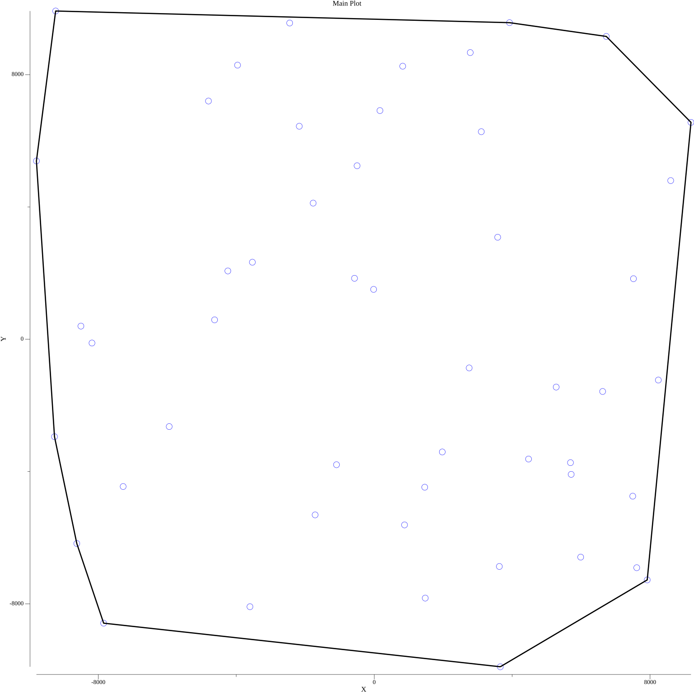

# Convex Hull and Delaunay Triangulation Visualization

This project provides a command-line tool to visualize the results of various
computational geometry algorithms, including Graham's Scan, Jarvis's March, and
Delaunay Triangulation. The output is rendered as PNG images, allowing users to
analyze the results visually.

## Overview
The main purpose of this project is to provide a benchmarking tool for
evaluating the performance of different algorithms in generating Convex Hulls
and Triangulations of a set of points in a 2D space.

## Algorithms Implemented

### 1. Graham Scan
- An efficient algorithm for computing the Convex Hull of a set of points.
- Time Complexity: 
- 𝑂(𝑛log𝑛)

O(nlogn), primarily due to the sorting step.

### 2. Jarvis's March
- Also known as the Gift Wrapping algorithm, it finds the Convex Hull by selecting the leftmost point and wrapping around the set of points.
- Time Complexity: 
- 𝑂(𝑛ℎ), where ℎ is the number of points in the hull.

### 3. Delaunay Triangulation
- A triangulation of a set of points such that no point is inside the circumcircle of any triangle.
- Time Complexity:
- 𝑂(𝑛log𝑛)


### Triangulation Example
1. **Delaunay Triangulation**:
   - A triangulation of a set of points such that no point is inside the circumcircle of any triangle.
   <div align="center">
     
   </div>

### Convex Hull Example
2. **Graham's Scan**:
   - An efficient algorithm for computing the Convex Hull of a set of points.
   <div align="center">
     
   </div>

## Installation
```bash
git clone https://github.com/ml3m/CompGeoVault.git
cd CompGeoVault
go build
```

## Usage
```bash
benchmark -n <number> -f <filename> -alg <algorithm>
```
### Options:
- -n   : Number of points or vertices to generate (default: 50)
- -f   : output filename for the plot  (default: output_plot.png)
- -alg : Algorithm to use (options: grahamscan, jarvismarch, delaunay) (default: grahamscan), be careful with spelling.


## Contributing
Contributions are welcome! Please open issues or pull requests for any features or improvements.

