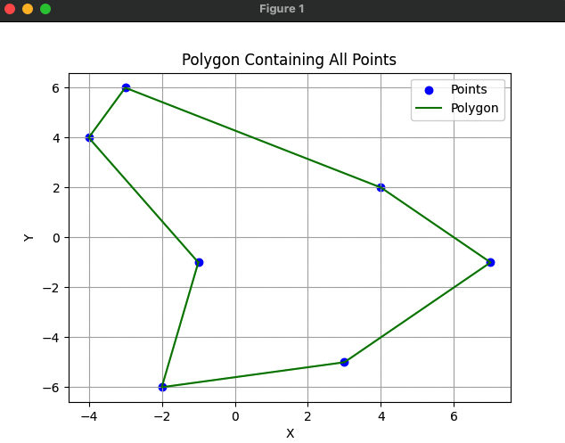

# Convex Hull Algorithm in the Scope of Creating the Polygon of Given Points
(O(n log n))

This repository contains an algorithm to compute a polygon that includes all
given points as vertices. The algorithm works by sorting the points in
counter-clockwise order around the centroid of the points, ensuring that the
polygon formed by these points is the convex hull of the set.

## How It Works

### Step 1: Calculate the Centroid First, the algorithm calculates the centroid
(geometric center) of the points. The centroid is simply the average of the
x-coordinates and the y-coordinates of all the points.

``` cx = sum(x) / n cy = sum(y) / n ```

Where `x` and `y` are the coordinates of the i-th point, and `n` is the number
of points.

### Step 2: Sort Points by Angle The algorithm then sorts the points by the
angle they make with the centroid. The `atan2()` function is used to compute
the angle of each point relative to the centroid in a counter-clockwise
direction.

Sorting the points by their angle with respect to the centroid guarantees that
they will be ordered in a way that forms a convex polygon.

### Step 3: Return Sorted Points After sorting, the algorithm returns the list
of points in counter-clockwise order around the centroid.

### Time Complexity: O(n log n)
- **Sorting Complexity**: The most time-consuming operation in this algorithm
  is the sorting of the points by their angle with respect to the centroid.
  Sorting has a time complexity of O(n log n), where `n` is the number of
  points.
- **Centroid Calculation**: Calculating the centroid involves summing the x and
  y coordinates of the points, which has a time complexity of O(n).
- The overall complexity is dominated by the sorting step, making the algorithm
  run in O(n log n).

## Example

Given the points:

``` 
P1 = (4, 2) P2 = (7, -1) P3 = (3, -5) P4 = (-3, 6) P5 = (-4, 4) P6 = (-1,-1) P7 = (-2, -6) 
```

The algorithm computes a convex polygon that encloses all the points.

## Visualization

The following image shows the computed polygon (green) that encloses all the
points (blue):


