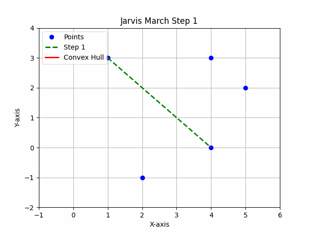

# Visual and Test visualization of Jarvis March Algorithm - Convex Hull 

This repository implements the **Jarvis March** algorithm to find the convex
hull of a set of 2D points. The algorithm works by finding the "leftmost" point
and iteratively selecting the next point that forms the smallest
counter-clockwise turn with the current set of points, until it returns to the
starting point. The result is the smallest convex polygon that encloses all the
points.

## How the Jarvis March Algorithm Works

### 1. **Finding the Leftmost Point**: The first step is to identify the
"leftmost" point (the one with the smallest x-coordinate) in the given set of
points. In case of a tie, the point with the largest y-coordinate is selected.

### 2. **Selecting the Next Point**: Starting from the leftmost point, the
algorithm iteratively selects the next point based on the orientation of the
triplet formed by the current point, the candidate point, and the next point in
the list.
   - **Orientation**: If the orientation of the triplet is counterclockwise,
     the candidate point becomes the new "next" point.
   - This process continues until we return to the starting point, forming the
     convex hull.

### 3. **Orientation Function**: The orientation of a triplet of points \(p\),
   q and r is determined by the following formula:
   
   text{Orientation} = (q.y - p.y) * (r.x - q.x) - (q.x - p.x) * (r.y - q.y)
   - If the result is positive, the points are counterclockwise.
   - If the result is zero, the points are collinear.
   - If the result is negative, the points are clockwise.

### 4. **Algorithm Steps**:
   - Find the leftmost point.
   - Iteratively select the next point that forms a counterclockwise turn.
   - Repeat the process until we reach the starting point again, completing the
     convex hull.

### Time Complexity:
- **Worst-case time complexity**: \(O(n^2)\), where \(n\) is the number of
  points. In practice, the algorithm performs better than this for smaller
  datasets.

## Example

Given the following points:
- \(P1 = (2, -1)\)
- \(P2 = (1, 3)\)
- \(P3 = (4, 0)\)
- \(P4 = (4, 3)\)
- \(P5 = (5, 2)\)

The algorithm computes the convex hull of these points.

### Visualization

The animation below shows the step-by-step execution of the Jarvis March
algorithm as it computes the convex hull for the given set of points.

The green lines represent the edges being selected at each step, while the red
polygon shows the convex hull formed after all steps.

