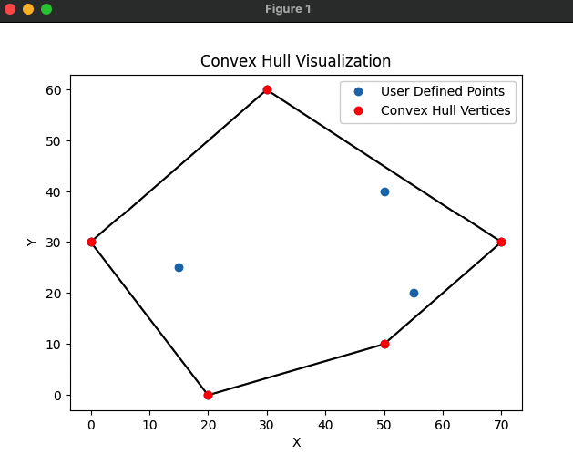

# QuickHull Algorithm Implementation

## Overview

QuickHull is an efficient algorithm for computing the convex hull of a set of points in a plane. The convex hull is the smallest convex polygon that encloses all the given points. This implementation provides a robust and efficient solution for finding the convex hull using a divide-and-conquer approach.

## Algorithm Explanation

The QuickHull algorithm works through the following key steps:

1. **Find Extreme Points**: 
   - Identify the points with the minimum and maximum x-coordinates
   - These points are guaranteed to be part of the convex hull

2. **Divide and Conquer**:
   - Divide the point set into two subsets using the line connecting the extreme points
   - Recursively find points that are farthest from this line
   - These farthest points help define the convex hull segments

3. **Recursive Partitioning**:
   - For each subset, find the point farthest from the current line
   - If this point is outside the current hull segment, it becomes a new vertex
   - Recursively process the triangular regions created by this point

## Time Complexity

- Average Case: O(n log n)
- Worst Case: O(n²)
- Best Case: O(n log n)
## Space Complexity

- O(n) additional space for recursive calls and storing hull points

## Example

### Input Points
Consider the following set of points:
```
Points = [(30, 60), (15, 25), (0, 30), (70, 30), (50, 40), (50, 10), (20, 0), (55, 20)]
```

### Convex Hull Visualization



In this visualization:
- Blue points represent the original point set
- Red points highlight the convex hull vertices
- The red line connects the convex hull points

## Usage

```python
points = [(0,3), (2,2), (1,1), (2,1), (3,0), (0,0), (3,3)]
convex_hull = quickhull(points)
print("Convex Hull Points:", convex_hull) # shows points. you can also plot them in matplotlib ui.
```

## References

1. Barber, C. Bradford, et al. "The quickhull algorithm for convex hulls." ACM
   Transactions on Mathematical Software (TOMS) 22.4 (1996): 469-483.
2. Preparata, Franco P., and Michael I. Shamos. "Computational geometry: an
   introduction." Springer Science & Business Media, 1985.
