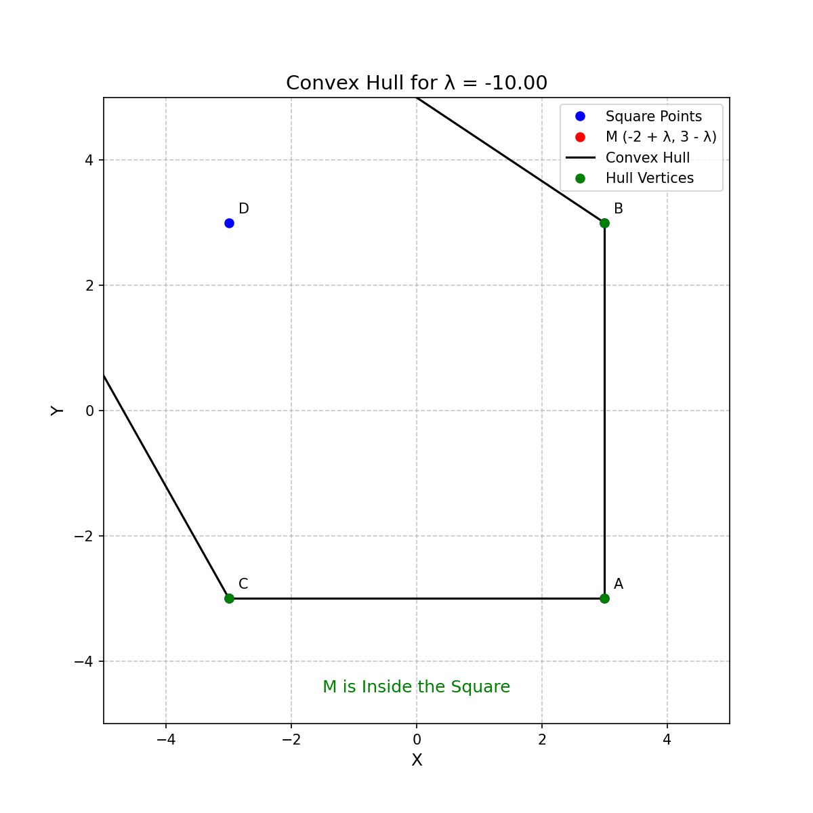

# Find Lambda Value Such That Specific Vertex Coordinates Are Not Part of the Convex Hull

This section describes how to find the value of \( \lambda \) for which certain
vertex coordinates (e.g., \( A \), \( B \), \( C \), or \( D \)) are no longer
part of the convex hull.

### Approach

The program computes the convex hull of a set of points, including a dynamic
point \( M \) that depends on the value of \( \lambda \). By varying \( \lambda
\), we determine when the convex hull changes and specific vertices (such as \(
C \)) are no longer part of the convex hull.

To identify the critical value of \( \lambda \) where a vertex is excluded from
the convex hull:

1. **Initialize the Square and Dynamic Point \( M \)**: The fixed points \( A
   \), \( B \), \( C \), and \( D \) are defined, and the point \( M \) moves
   with changing \( \lambda \).
   
2. **Calculate the Convex Hull**: For each value of \( \lambda \), the convex
   hull of the points is computed. If a specified vertex, such as \( C \), is
   part of the convex hull, we continue; if it is excluded, we track the
   corresponding value of \( \lambda \).

3. **Find the Transition Point**: The point where a specific vertex is no
   longer part of the convex hull is logged, and the corresponding \( \lambda
   \)-value is printed. This can be done either through iteration or by
   analyzing the vertices of the convex hull.

### Visualization

