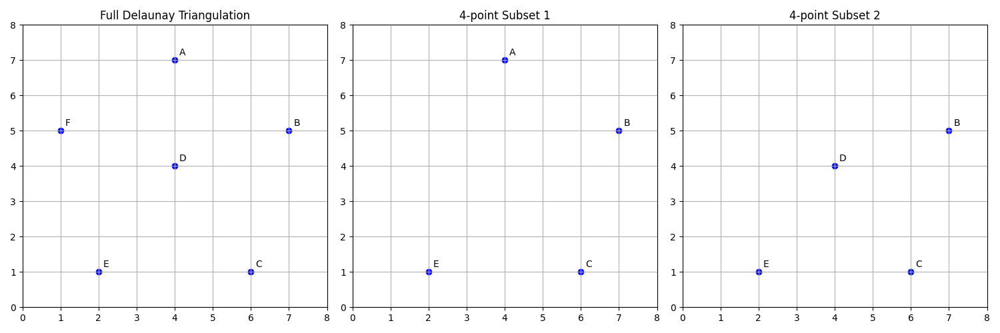

# Exercise Five
## Special 6-Point Triangulation

This exercise demonstrates a specific triangulation case with 6 points and special subset properties.

### Problem Description
Create a set of exactly 6 points that:
- Admits a triangulation with 10 edges
- Contains a 4-element subset that admits a 4-edge triangulation

### Visualization
The solution is animated to show the construction process:

### Key Features
- Complete triangulation with 10 edges
- Special 4-point subset demonstration
- Step-by-step construction visualization
