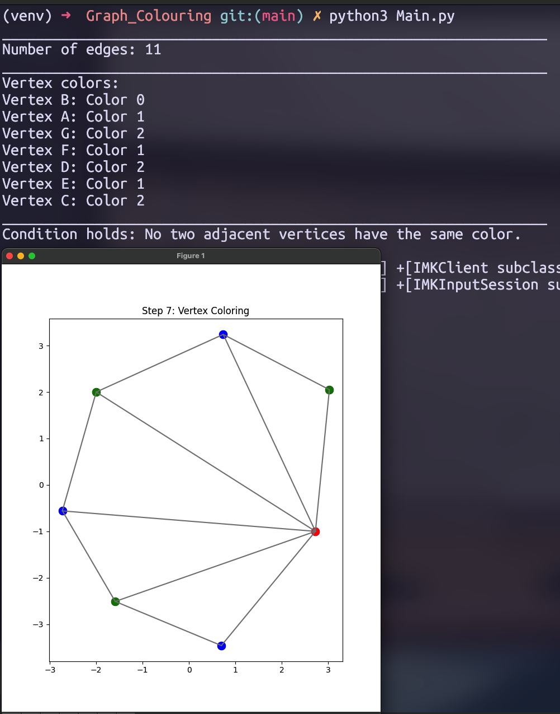

# Exercise Four
## 11-Edge Triangulation

This exercise demonstrates a triangulation with 11 edges and proves its 3-colorability.

### Problem Description
Create and visualize a set of points M = {A, B, C, D, E, F, G} that admits a triangulation with 11 edges.

### Solution
The solution includes:
- Point placement strategy
- Triangulation construction
- 3-colorability proof

### Visualization

