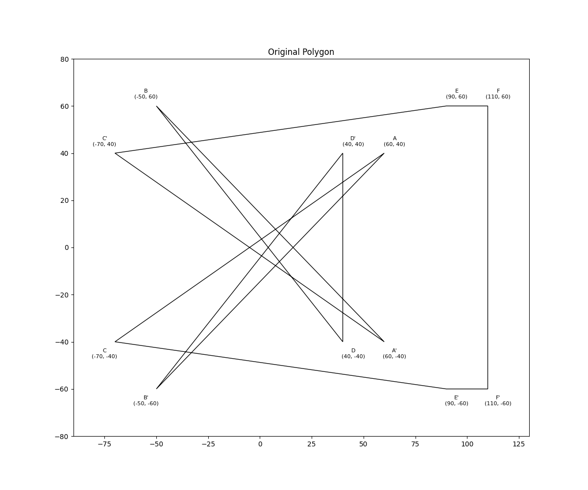

# Exercise One
## Art Gallery Problem - Symmetrical Polygon

This exercise demonstrates the application of the Art Gallery Theorem for a polygon with symmetric points about the Ox axis.

### Problem Description
Apply the method of the art gallery theorem for a polygon P₁P₂...P₁₂, where:
- P₁ = (4, -4)
- P₂ = (-5, 6)
- P₃ = (6, -4)
- P₄ = (-7, 4)
- P₅ = (9, 6)
- P₆ = (11, 6)
- Points P₇ to P₁₂ are symmetrical points of P₆ to P₁ with respect to the Ox axis

### Solution Visualization

# iregular polygon

