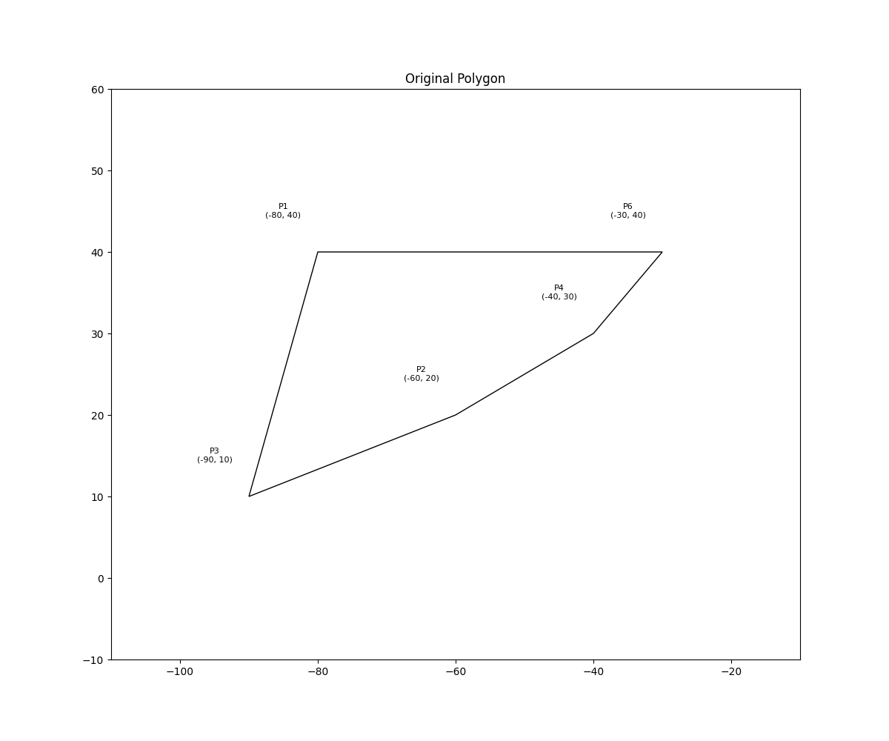

# Exercise Three
## Triangulation with 3 Triangles and 5 Edges

This exercise demonstrates a specific triangulation case with colored vertices.

### Problem Description
Create and visualize a set of points in the plane that admits a triangulation with:
- 3 triangles
- 5 edges
- Prove 3-colorability of the triangulation graph

### Solution Visualization
- where the polygon has 3 triangles and 7 edges.

