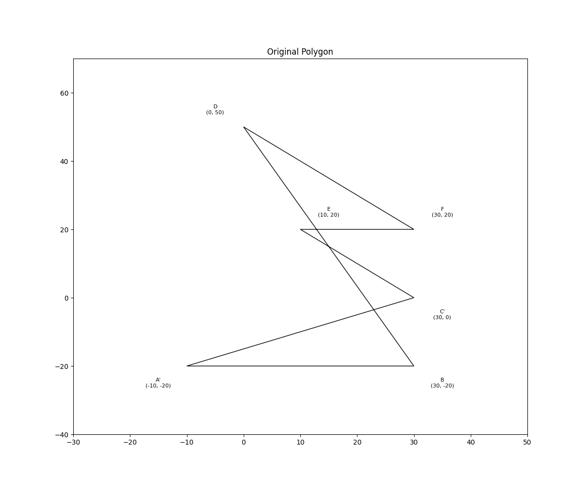

# Exercise Two
## Art Gallery Problem - Multiple Camera Configurations

This exercise explores different camera placement configurations for a specific polygon using the Art Gallery Theorem.

### Problem Description
Consider the polygon P₁P₂P₃P₄P₅P₆, where:
- P₁ = (0, 5)
- P₂ = (3, -2)
- P₃ = (-1, -2)
- P₄ = (3, 0)
- P₅ = (1, 2)
- P₆ = (3, 2)

The solution demonstrates:
a. A configuration where one camera is sufficient
b. A configuration where two cameras are necessary and sufficient

### Solution Visualization

